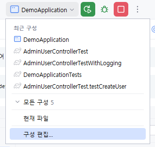
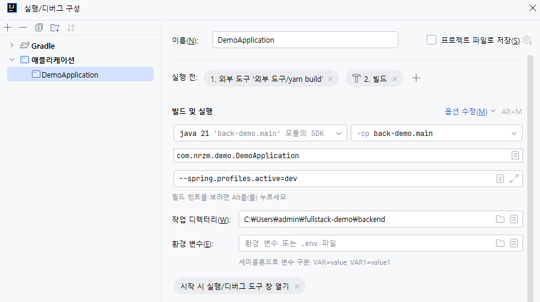
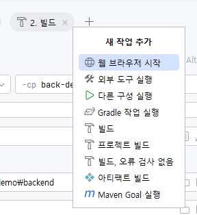
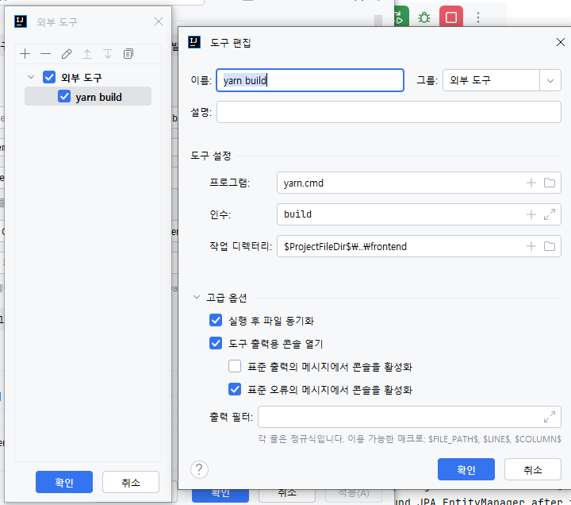
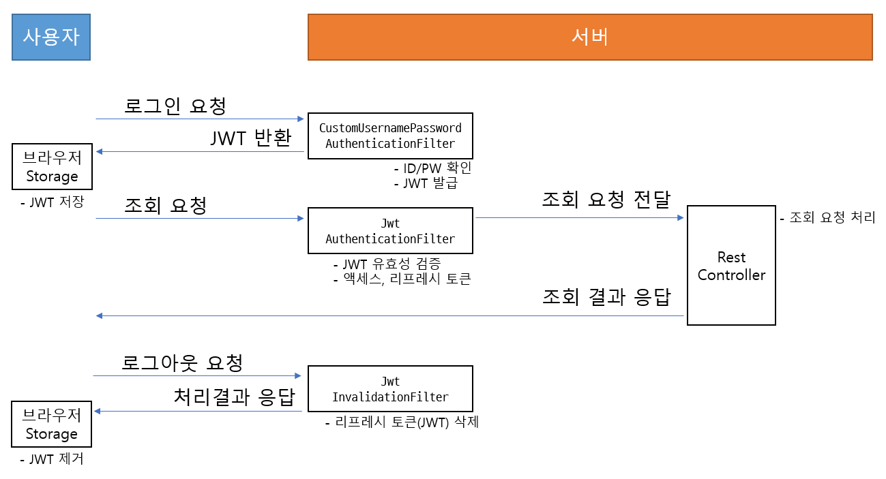

> 개발 환경 작업 시 옵션 설정을 해야, 테스트 데이터를 자동으로 생성합니다. 아래 인텔리J 구성 참고

```shell
--spring.profiles.active=dev
```

> ## 인텔리J 개발 프로젝트 실행 구성

### 인텔리J 상단 메뉴바 오른쪽의 버튼을 눌러 `구성 편집`을 실행


### 아래처럼 `실행 전` 항목에 외부 도구가 없는 경우 `+` 를 눌러 추가 필요


### `새 작업 추가` 에서 `외부 도구 실행` 선택하고


### 외부 도구를 선택하고 역시 상단의 `+` 클릭, 입력항목을 참고해서 입력



> 위와 같이 설정하게 되면 스프링부트 backend 실행 전 최신 프론트엔드 코드를
> 직접 빌드하고 스프링부트의 정적 자원으로 복사하여 한 서버에서 실행하도록 구성됨

# 스프링부트, JWT인증, 사용자 DB 로그인

웹 요청에 대해 스프링 시큐리티의 대략적인 흐름은 다음과 같습니다.

> 사용자 요청 -> AuthenticationManager -> FilterChain (... *Filter.java) -> 컨트롤러

## 스프링 시큐리티 처리 절차

스프링 시큐리티 구성으로 웹 요청에 대한 전체 처리 절차는 다음과 같습니다.


[출처 Spring Security / Servlet Applications / Authentication / Authentication Architecture](https://docs.spring.io/spring-security/reference/servlet/authentication/architecture.html#servlet-authentication-abstractprocessingfilter)

## 프로젝트 기준 버전

- 스프링부트 `3.3.1`
- 스프링시큐리티 `6.3.1`
  - 버전을 별도 명시하지 않는 한 스프링부트 3.3.1 의 의존성 정보가 시큐리티 6.3.1을 사용함

## 프로젝트의 스프링 시큐리티 주요 구성

1. 스프링시큐리티 구성 `SecurityConfig.java`
2. 인증실행 관리 `AuthenticationManagerConfig.java`
3. 사용자정보 관리 `CustomUserDetailsService.java`
4. 필터 관리
   - 아이디/패스워드 인증 및 JWT 생성 `CustomUsernamePasswordAuthenticationFilter.java`
   - JWT 인증 `JwtAuthenticationFilter.java`
   - JWT 무효화 `JwtInvalidationFilter.java`

### 스프링시큐리티 구성 `SecurityConfig.java`

`SecurityConfig.java` 파일은 스프링 시큐리티의 주요 설정을 담고 있습니다. 이 클래스는 스프링 시큐리티 설정을 통해 애플리케이션의 보안 정책을 정의합니다. 주로 HTTP 보안 설정, 인증 및 권한 부여 설정, 시큐리티 필터 체인 설정 등을 포함합니다. 일반적으로 `@EnableWebSecurity` 어노테이션을 사용하여 스프링 시큐리티 설정 클래스로 지정합니다.

### 인증실행 관리 `AuthenticationManagerConfig.java`

이 클래스는 `AuthenticationManager` 빈을 정의하고 설정합니다. `AuthenticationManager`는 사용자의 인증을 처리하는 클래스를 관리하며, 여러 인증 프로바이더를 사용하여 다양한 방식의 인증을 지원할 수 있습니다. 이 클래스에서 인증 프로바이더를 추가하고 구성할 수 있습니다.

### 사용자정보 관리 `CustomUserDetailsService.java`

이 클래스는 `UserDetailsService` 인터페이스를 구현하며, 사용자 정보를 조회하는 메서드를 제공합니다. 데이터베이스나 다른 저장소에서 사용자 정보를 조회하여 스프링 시큐리티가 인증을 수행할 수 있도록 합니다. 사용자명에 따라 사용자의 권한과 기타 정보를 로드하는 역할을 합니다.

### 필터 관리

#### 아이디/패스워드 인증 및 JWT 생성 `CustomUsernamePasswordAuthenticationFilter.java`

`CustomUsernamePasswordAuthenticationFilter.java` 파일은 아이디와 패스워드를 통한 인증을 처리하고 JWT를 생성하는 필터입니다. 이 필터는 사용자가 제공한 아이디와 패스워드를 검증하고, 인증이 성공하면 JWT를 생성하여 반환합니다. 스프링 시큐리티의 `UsernamePasswordAuthenticationFilter`를 확장하여 커스터마이징한 필터입니다.

#### JWT 인증 `JwtAuthenticationFilter.java`

`JwtAuthenticationFilter.java` 파일은 JWT를 통한 인증을 처리하는 필터입니다. 이 필터는 요청의 헤더에 포함된 JWT를 검증하고, 유효한 경우 해당 토큰에서 사용자 정보를 추출하여 인증을 설정합니다. 주로 HTTP 요청의 `Authorization` 헤더에서 JWT를 추출하고 검증합니다.

#### JWT 무효화 `JwtInvalidationFilter.java`

`JwtInvalidationFilter.java` 파일은 JWT를 무효화하는 필터입니다. 이 필터는 특정 조건에 따라 JWT를 무효화하고, 무효화된 JWT가 더 이상 사용되지 않도록 합니다. 예를 들어, 사용자가 로그아웃할 때 해당 사용자의 JWT를 무효화할 수 있습니다. JWT 무효화는 보안 강화를 위해 중요한 역할을 합니다.


### 인증 및 사용의 주요 처리 절차

